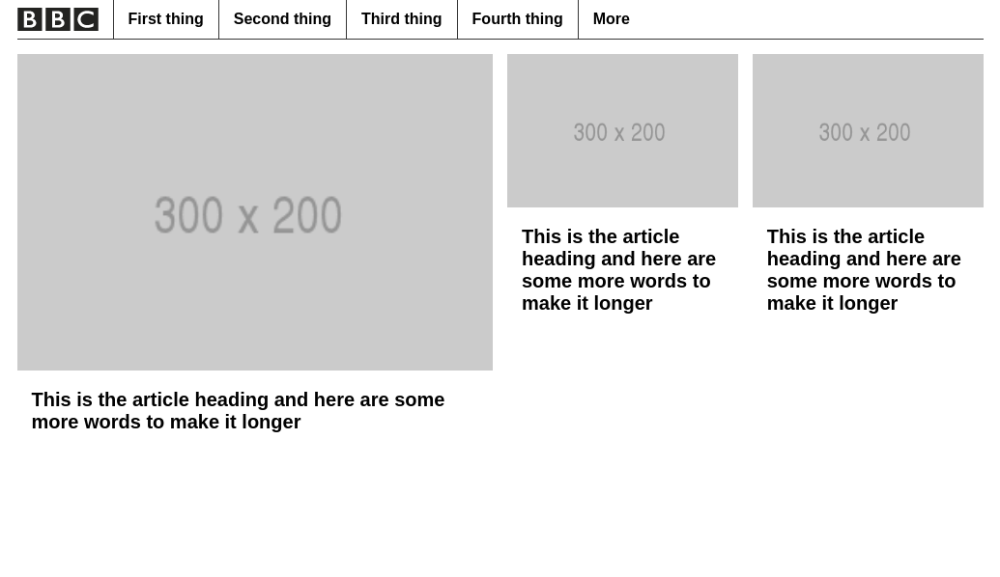

# Session 2

## Outline plan

### Couple of tweaks from session 1

- Constrain the site to a reasonable width
  Apply `max-width` to the `body` element and centre it with `margin: 0 auto`
- Switch to a better font for screen display
  Apply `font-family` to the `body` element and set it to `"Arial", sans-serif`

### Navigation banner

  

- Adding a navigation banner to our site
  - Create a `<nav>` element
  - Add an `` element and pop the BBC logo in it. (https://nav.files.bbci.co.uk/orbit/2.0.0-128.414982a/img/blq-orbit-blocks_grey.svg)  
  _For the curious among you - view the source of the SVG file... Whilst it is complex, it is human readable and editable!_
  - Wrap the logo in an `<a>` tag and link it to `#` (Effectively a "no-op" for links.)
  - Consider the accessibility of this element. You might want to add some hidden text for screen readers saying "Return to the homepage". [See here for a class which lets you create invisible text](https://github.com/h5bp/html5-boilerplate/blob/86df1ead6fbaddd28ea95be727810571144ff797/dist/css/main.css#L129)
  - Add a `<ul>` element and `<li>` and `<a>` elements for each navigation item.
  - Use the `float` property from last week's session to sit the items up on a single line
  - Apply `padding`, `border` and `font-weight` styles to achieve the design.  
    Think carefully about where you apply the padding to achieve a large "hit area" on the links

- Adding simple JS toggle to the "more" link
