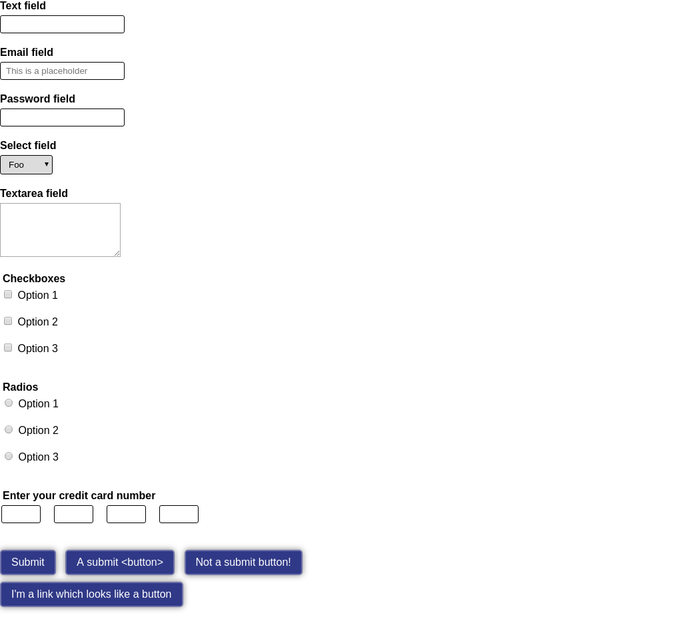

# Session 3 (http://bit.ly/2DpT1YU)

Model answer here: https://andymantell.github.io/frontend-training-1-html-and-css-fundamentals/session-3/model-answer/form.html

## Goal



## Outline plan

- Set up the form:
  `<form class="form" method="GET" action="/">`

- Add text, email, password, select, textarea, checkbox and radio fields. Consider markup something like the following:

text, email and password
```
<div class="form__element">
    <label class="form__label" for="demoTextId">Text field</label>
    <input class="form__control" type="text" id="demoTextId" name="demoTextName">
</div>
```

- select boxes look like this:
```
<select class="form__control" id="idGoesHere" name="nameGoesHere">
    <option value="1">Foo</option>
    <option value="2">Bar</option>
    <option value="3">Wibble</option>
</select>
```

- checkbox and radio fields need to go inside a `<fieldset>` and have a `<legend>` describing the group. The label for each checkbox then describes the option within the group. For example: "Do you like chocolate?" is the legend, and "Yes" and "No" would be the labels.

- textareas look like this:

```
<textarea id="idGoesHere" name="nameGoesHere" rows="5"></textarea>
```

- Buttons
  - Create an `<input type="submit" value="Submit">` element
  - Add a `.button` class and style it up how you please. (Note that by styling the class, we are abstracting the button styles away from the input, so they can be used on links etc as well)

- A credit card number field that:
  - Has separate fields for each group of 4 digits
  - Uses a fieldset and legend to describe the group of fields
  - Has visuallyhidden labels for each input
  - Uses what you've learnt about `float` to lay the fields out next to each other. (You could also use `display: inline` or flexbox, but we haven't covered that. Feel free to complete http://flexboxfroggy.com/)
  - triggers the numeric keypad on mobile by using [inputmode](https://developer.mozilla.org/en-US/docs/Web/HTML/Element/input#attr-inputmode)
  - Stretch goal - style the fieldset to look like a debit card.
